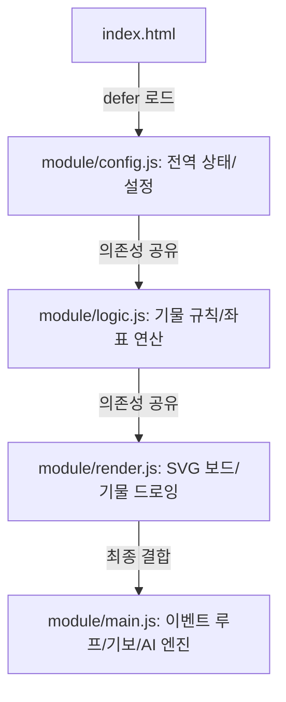

# 장기 프로젝트 개발자용 가이드 (Janggi Developer & LLM metadata Guide)

본 문서는 장기 웹 애플리케이션의 내부 구조, 좌표계 설계 규칙, 기물 ID 매핑, 기보 포맷 및 AI 탐색 메커니즘을 신속하게 파악할 수 있도록 작성된 메타데이터 가이드라인입니다. 새로운 개발자나 LLM 에이전트가 코드를 해독하거나 수정할 때 이 규칙을 최우선으로 따르십시오.

---

## 1. 파일 구조 및 역할 분담 (Architecture Overview)

장기 게임은 글로벌 네임스페이스를 공유하는 4개의 모듈식 스크립트 파일로 구성되어 있으며, `index.html`에서 `defer` 옵션으로 순서대로 호출됩니다.



- **`module/config.js`**:
  - 보드 크기 비율, 애니메이션 시간, 설정 슬롯 데이터 구조, 전역 기물 배열(`pieces`)과 착수 로그(`log`)를 보관하는 데이터 레이어입니다.
- **`module/logic.js`**:
  - 보드 위 좌표 검사, 아군/적군 판별, 기물별 이동 가능 경로 계산 등 순수 장기 규칙만을 전담하는 엔진입니다.
- **`module/render.js`**:
  - SVG 격자판, 좌표 라벨, 기물 SVG 엘리먼트 갱신, 동적 후보지 박스(`.candi-svg`) 그리기 등 그래픽 렌더링을 전담합니다.
- **`module/main.js`**:
  - 사용자 마우스 클릭 핸들러, 설정 변경 리스너, 로컬스토리지 슬롯 및 기보 보관함 입출력, Minimax 인공지능 탐색 엔진 및 외통수 잠금을 주도하는 메인 컨트롤러입니다.

---

## 2. 좌표계 설계 규칙 (Coordinate System Quirks)

장기판은 가로 9열, 세로 10행의 격자 구조를 가집니다.

- **X축 (가로)**: 왼쪽에서 오른쪽 방향으로 `1`부터 `9`까지의 정수값을 가집니다.
- **Y축 (세로 - 매우 중요)**:
  - 사용자 화면 상단의 첫 행(한나라 진영 맨 뒤)은 **`1`**로 시작하여 아래로 가면서 `2`, `3`, ..., `9`로 증가합니다.
  - **화면의 맨 하단 10번째 행(초나라 진영 맨 뒤)은 `0`으로 표현됩니다.**
  - **Y축 값의 흐름**: `1` (최상단) $\rightarrow$ `2` $\rightarrow$ `3` $\rightarrow$ `4` $\rightarrow$ `5` $\rightarrow$ `6` $\rightarrow$ `7` $\rightarrow$ `8` $\rightarrow$ `9` $\rightarrow$ `0` (최하단)
  - **도화지 Y 인덱스 계산 공식** (`logic.js` - `getAxis()`):
    $$\text{rowIndex} = (y + 9) \pmod{10}$$
    (예: $y=1 \rightarrow 10 \pmod{10} = 0$, $y=9 \rightarrow 18 \pmod{10} = 8$, $y=0 \rightarrow 9 \pmod{10} = 9$)
- **yNext(y) / yPrev(y)**:
  - `yNext(y)` (아래로 이동): $1 \rightarrow 2 \rightarrow \dots \rightarrow 9 \rightarrow 0 \rightarrow -1$ (범위 밖)
  - `yPrev(y)` (위로 이동): $0 \rightarrow 9 \rightarrow 8 \rightarrow \dots \rightarrow 2 \rightarrow 1 \rightarrow -1$ (범위 밖)

---

## 3. 기물 고유 ID 테이블 (Piece ID Mapping)

보드판 위 32개의 장기 기물은 `0`번부터 `31`번까지 고정된 고유 인덱스를 부여받아 `pieces` 배열에서 전역 관리됩니다.

| ID 범위 | 진영 | 역할 | 개별 기물 식별 매핑 |
| :--- | :---: | :---: | :--- |
| **`0`** | **초 (Blue)** | **궁 (楚)** | 초나라 왕 |
| **`1 ~ 2`** | 초 (Blue) | **차 (車)** | `1`: 좌차, `2`: 우차 |
| **`3 ~ 4`** | 초 (Blue) | **포 (包)** | `3`: 좌포, `4`: 우포 |
| **`5 ~ 6`** | 초 (Blue) | **마 (馬)** | `5`: 좌마, `6`: 우마 (상차림에 따라 위치 가변) |
| **`7 ~ 8`** | 초 (Blue) | **상 (象)** | `7`: 좌상, `8`: 우상 (상차림에 따라 위치 가변) |
| **`9 ~ 10`** | 초 (Blue) | **사 (士)** | `9`: 궁성 내 좌사, `10`: 궁성 내 우사 |
| **`11 ~ 15`** | 초 (Blue) | **졸 (卒)** | `11`: 첫 번째 졸 $\rightarrow$ `15`: 다섯 번째 졸 |
| **`16`** | **한 (Red)** | **궁 (漢)** | 한나라 왕 |
| **`17 ~ 18`** | 한 (Red) | **차 (車)** | `17`: 좌차, `18`: 우차 |
| **`19 ~ 20`** | 한 (Red) | **포 (包)** | `19`: 좌포, `20`: 우포 |
| **`21 ~ 22`** | 한 (Red) | **마 (馬)** | `21`: 좌마, `22`: 우마 |
| **`23 ~ 24`** | 한 (Red) | **상 (象)** | `23`: 좌상, `24`: 우상 |
| **`25 ~ 26`** | 한 (Red) | **사 (士)** | `25`: 궁성 내 좌사, `26`: 궁성 내 우사 |
| **`27 ~ 31`** | 한 (Red) | **병 (兵)** | `27`: 첫 번째 병 $\rightarrow$ `31`: 다섯 번째 병 |

- 기물이 포획(사망)되어 판 위에 존재하지 않을 경우, 기물 좌표는 `x = 0, y = 0`으로 수렴합니다.

---

## 4. 기보 데이터 및 저장 스키마 (Record Schema)

대국 행마 기록은 전역 `log` 배열에 다음과 같은 구조로 직렬화되어 보관됩니다.

### LogEntry 데이터 구조
```typescript
interface LogEntry {
  i: number; // 움직인 기물의 ID (0 ~ 31)
  x: number; // 이동 타겟 X 좌표 (1 ~ 9)
  y: number; // 이동 타겟 Y 좌표 (0 ~ 9)
  t: number; // 잡힌 기물의 ID (잡은 기물이 없으면 32)
}
```

### 텍스트 기보 파일 표준
클립보드에 내보내기/불러오기 되는 기보 포맷 예시는 다음과 같습니다.
```text
상차림: 초하(마상마상) vs 한상(마상마상)
1. 72졸62
2. 23포43
3. 09사08
```
- 행마 표기는 **`[출발X][출발Y][기물명][도착X][도착Y]`** 형식으로 표현됩니다. (예: `72졸62` $\rightarrow$ X=7, Y=2 위치에 있던 '졸' 기물이 X=6, Y=2 위치로 이동함)

---

## 5. 인공지능 (AI) 대국 엔진 Heuristics

AI 기능은 Minimax Depth-2 예측 연산 및 상태 평가 함수를 따릅니다.

### 기물별 고유 가치 점수
- **궁 (King)**: $100,000$ (절대 탈환 대상)
- **차 (Chariot)**: $130$
- **포 (Cannon)**: $70$
- **마 (Horse)**: $50$
- **상 (Elephant)**: $30$
- **사 (Guard)**: $30$
- **졸/병 (Soldier)**: $20$

### 포지션별 보너스
- **X축 가중치**: 판의 중심에 가깝게 포진할수록 추가 점수 부여 ($|x - 5|$ 값에 반비례, 최대 $2.0$점)
- **Y축 가중치**: 아군 기물이 적진을 향해 깊숙이 전진할수록 전진도 비례 추가 점수 부여 (최대 $3.0$점)
- **덤 (Handicap)**: 한나라는 후수로 시작하므로 최종 한나라 점수에 $+1.5$점 보정 추가

---

## 6. 키보드 단축키 및 접근성 설계 (Keyboard Navigation Shortcuts)

키보드 화살표 및 엔터/스페이스 바를 이용한 접근성 단축키 모드를 내장하고 있습니다.

- **커서 활성화**: 대국 중 아무 방향키(`ArrowUp`, `ArrowDown`, `ArrowLeft`, `ArrowRight`)나 누르면 즉시 초록색 네온 점선 사각형의 키보드 커서가 활성화됩니다.
  - 최초 활성화 시, 선택된 기물이 있으면 해당 기물 위치에서 시작하고, 없으면 현재 차례 진영의 **궁(King)** 위치에서 포커스가 시작됩니다.
- **포커스 이동**: 방향키를 통해 가로 9열(1~9), 세로 10행(1~9 및 0) 범위 내에서 격자 단위로 유기적 커서 이동을 처리합니다. (경계를 넘어가지 않도록 가드 보장)
- **기물 선택 및 착수 (Enter / Space)**:
  - 기물이 선택되지 않은 상태에서 본인 차례의 아군 기물 위에 커서를 대고 Enter/Space를 누르면 기물이 **선택**되고 후보지들이 화면에 출력됩니다.
  - 기물이 이미 선택된 상태에서 커서를 후보지(가용 이동 범위)로 옮긴 후 Enter/Space를 누르면 그 자리로 **착수**가 완료되고 커서가 숨겨집니다.
  - 만약 후보지가 아닌 곳에 있는 다른 아군 기물에 대고 누르면 **선택 대상이 변경**되며, 빈 공간이나 적군 기물 위에서 누르면 **선택이 해제**됩니다.
- **선택 취소 및 커서 끄기 (Escape)**: ESC 키를 누르면 기물 선택이 취소되고 키보드 포커스 커서가 화면에서 보이지 않게 숨김 처리됩니다.
