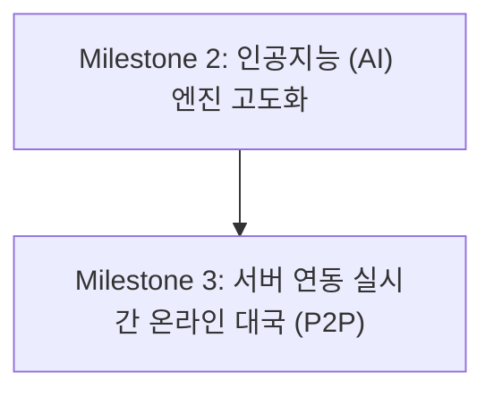

# 🗺️ 웹 장기 프로젝트 개발 로드맵 (Development Roadmap)

프로젝트의 기능 고도화를 코드 꼬임 없이 안정적으로 하나씩 순차 개발하기 위해 수립한 단계별 마일스톤(Milestone) 계획입니다.

---

## 🎯 마일스톤 구성

---

## 📌 Milestone 2: 인공지능 (AI) 엔진 고도화
Minimax 알고리즘을 확장하고 연산 성능을 비약적으로 높이는 백엔드/엔진 튜닝 단계입니다.

### 1) 탐색 효율 극대화
- **Alpha-Beta Pruning (알파베타 가지치기)**: 탐색 불필요 노드를 제거하여 동일 시간 내 탐색 depth를 3~4단계 이상으로 확장
- **이동 정렬 (Move Ordering)**: 가치가 높은 수(기물 잡기, 장군 등)를 먼저 탐색하여 프루닝 효율 극대화

### 2) 평가 함수 (Evaluation Function) 세분화
- **기물 협동성 및 안전도**: 궁을 지키는 사(Guard)의 호위 점수 가중치 부여
- **기물 활동 범위**: 포(Cannon)가 다리를 놓았는지 여부, 차(Chariot)의 가로세로 활성 격자 면적 연산 반영

---

## 📌 Milestone 3: 서버 연동 실시간 온라인 대국 (Multiplayer Server Integration)
데이터베이스 및 네트워크 통신을 결합하여 실제 원격 대국자와 장기를 둘 수 있는 단계입니다.

### 1) 백엔드 데이터베이스 및 API 서버 구축
- **대국방(Lobby) 생성/참가 API**: 고유 방 코드를 통한 매칭 처리
- **기보 동기화**: 실시간 착수 로그를 서버 DB에 기록

### 2) 상대방 착수 실시간 동기화
- **통신 기법**: WebSocket 연동 또는 주기적 Long-Polling 방식을 활용해 상대방이 둔 수를 내 보드에 애니메이션과 함께 실시간 재현
- **네트워크 가드**: 턴 제어 및 타임아웃 처리, 불법 무브 네트워크 필터 검증
