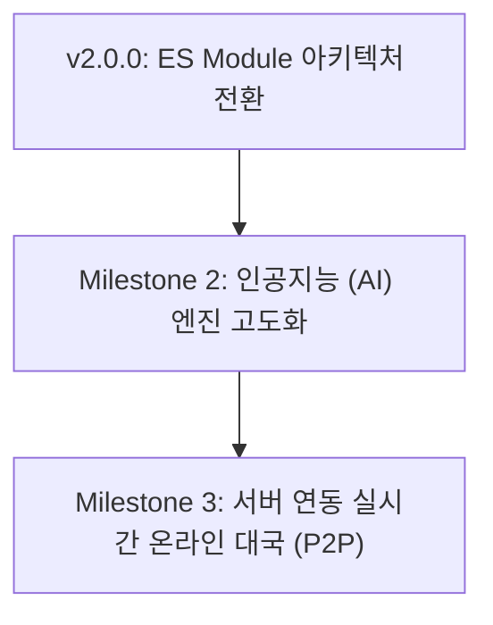
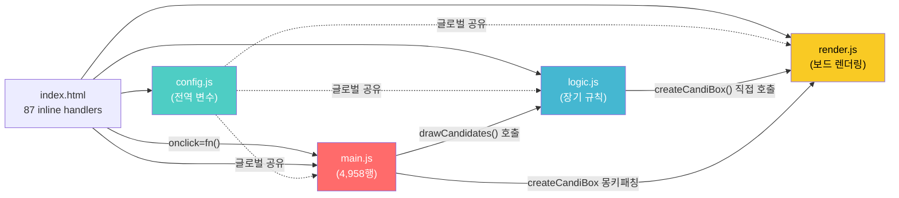
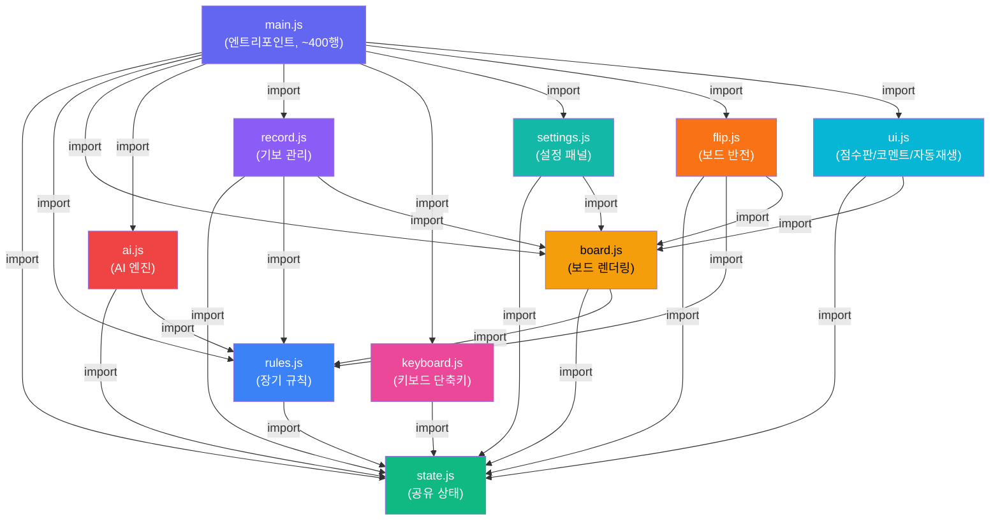
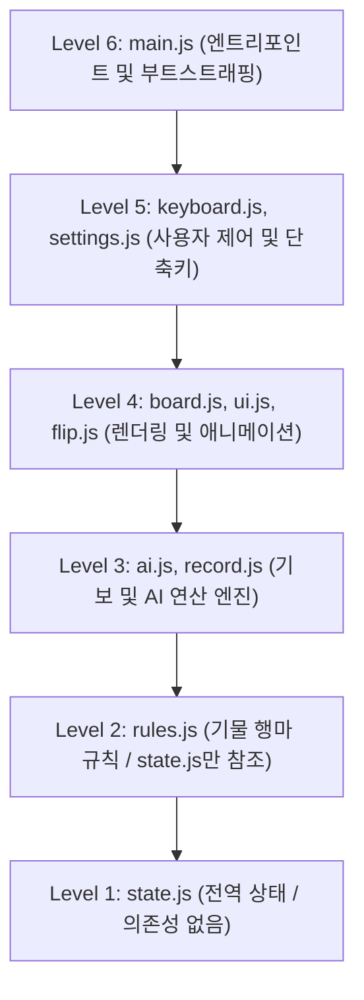

# 🗺️ 웹 장기 프로젝트 개발 로드맵 (Development Roadmap)

프로젝트의 기능 고도화를 코드 꼬임 없이 안정적으로 하나씩 순차 개발하기 위해 수립한 단계별 마일스톤(Milestone) 계획입니다.

---
## 당장 수행할 과제

- [v2.0.0] ES Module 아키텍처 전환 및 전면 리팩터링 (아래 상세 기술)

## 🎯 마일스톤 구성



---

## 📌 v2.0.0: ES Module 아키텍처 전환 및 전면 리팩터링

글로벌 네임스페이스를 공유하는 4개의 `<script defer>` 파일 구조를 ES Module (`import`/`export`) 기반의 명시적 의존성 구조로 전면 전환합니다. 소규모 프로젝트에서 점진적으로 성장하며 173KB 단일 파일(`main.js`, 4,958행)에 집중된 코드를 역할별로 분리하여 유지보수성, 테스트 가능성, 확장성을 확보합니다.

---

### 1) JavaScript 모듈 분리 (main.js 해체 → 10개 ES Module)

기존 `module/` 디렉토리의 4개 파일을 10개 독립 모듈로 재편합니다.

- **`state.js`** (기존 `config.js` 리네이밍): 전역 상태 객체를 단일 소스로 `export`. `pieces`, `log`, `iAmCho`, `gameMetadata` 등 모든 공유 상태를 하나의 `gameState` 객체로 통합 관리. 상수(`knownStart`, `shortcutKeys` 기본값)도 분리 보관
- **`rules.js`** (기존 `logic.js` 리팩터링): 좌표 유틸(`getAxis`, `yNext`, `yPrev`), 진영 판별(`checkTeam`, `isEnemy`, `whoIsit`), 기물별 이동 규칙(`getKingOrGuardMoves`, `getChariotMoves`, …)을 순수 함수로 유지. **핵심 변경**: `createCandiBox` 호출 대신 `{x, y}` 배열을 반환하도록 리팩터링하여 로직과 렌더링 결합 해소
- **`board.js`** (기존 `render.js` 리팩터링): SVG 보드 그리기(`initBoard`, `drawBoard`), 기물 위치 배치(`initPositions`, `setPieces`), 후보지 렌더링(`renderCandidateMarkers` — 기존 `createCandiBox` 리네이밍), 키보드 커서, 점수 막대 갱신. rules.js가 반환한 이동 배열을 받아 SVG로 시각화
- **`ai.js`** [신규]: Minimax Depth-2 탐색 엔진 독립화. `evaluateBoard(pieces, iAmCho)`, `getBestMove(aiTeam, pieces, iAmCho, getValidMovesFn)`, `getLegalMoves(team, pieces, iAmCho)`, `getFilteredLegalMoves()`, `isKingInCheck()`, `checkGameStatus()` 등을 **순수 함수 + 매개변수 주입** 방식으로 분리. `createCandiBox` 몽키패칭 제거
- **`record.js`** [신규]: 기보 생성(`generateGameRecordText`), 파싱(`parseMoveLine`, `parseLayoutText`, `determineIAmChoFromText`), 가져오기/내보내기(`importRecordFromText`), 기보 보관함 CRUD(`saveRecordToLibrary`, `loadSavedRecord`, `deleteSavedRecord`), UI 갱신(`updateRecordUI`, `updateSavedRecordsListUI`, `openRecordModal`, `closeRecordModal`)
- **`keyboard.js`** [신규]: 키보드 전역 리스너(`handleKeyDown`), 단축키 매칭(`matchShortcutKey`), 단축키 모달(열기/닫기/테이블 렌더링/키 녹화), 단축키 마이그레이션(`migrateShortcutKeys`), 기본값 초기화(`resetDefaultShortcuts`)
- **`settings.js`** [신규]: 설정 패널 전체 — 모든 `change*()` 커스터마이징 함수, 슬롯 관리(`saveCurrentConfigToSlot`, `loadConfigFromSlot`, `selectSlot`), 설정 패널 테마(`updateSettingsBoxStyle`, `updateSettingsTextColor`, `updateSettingsAccentColor`), 카테고리 초기화(`resetCategory1~4`), `initSettingsUI()`, 패널 열기/닫기(`showSettingsPanel`, `hideSettingsPanel` — 기존 오타 함수명 `enalbeSettingBox`/`disalbeSettingBox` 교정)
- **`flip.js`** [신규]: 판 좌우 반전(`flipBoardHorizontal`, `executeFlipBoardHorizontal`) 및 상하 반전(`flipBoardVertical`, `executeFlipBoardVertical`), 좌표 변환 유틸(`flipYCoordinate`, `normalizeLayoutCode`, `rotateLayoutCode180`)
- **`ui.js`** [신규]: 회전 점수판(`initScoreboardRotation`, `rotateScorePanel`, `setScoreSlide`, `applyScoreboardConfig`, `updateScoreboardTimer`), 메타데이터 폼(`updateMetadataFromForm`, `updateMetadataFormFromState`, `updateMetadataDisplay`), 코멘트 말풍선(`updateCommentBubble`, `hideCommentBubble`), 코멘트 모달(`openCommentModal`, `closeCommentModal`, `saveCommentModal`), 자동재생(`toggleAutoplay`, `startAutoplay`, `stopAutoplay`, `updateAutoplayUI`), 토스트 알림(`showToast`), 아코디언 토글(`toggleMetadataCategory`, `toggleSettingCategory`)
- **`main.js`** (엔트리포인트 축소): `initGame()` 부트스트랩, `initData()`, `initElements()`, `getData()`, 핵심 게임 루프(`selected()`, `move()`, `next()`, `prev()`, `performSinglePrev()`), 새 게임/진영 전환(`startNewGame`, `changeNation`, `toggleNation`), `window.addEventListener('resize')` 및 `keydown` 위임. 모든 기능은 import 호출로 위임

### 2) `createCandiBox` 결합 해소 (아키텍처 핵심 개선)

현재 `logic.js`의 행마 규칙 함수들이 `render.js`의 `createCandiBox()`를 직접 호출하고, AI의 `getLegalMoves()`가 이를 런타임에 몽키패칭하는 **안티패턴**을 제거합니다.

- **Before**: `getChariotMoves(i)` → 내부에서 `createCandiBox(i, x, y)` 호출 (SVG 렌더링 직접 트리거)
- **After**: `getChariotMoves(pieceId, pieces)` → `[{x, y}, ...]` 배열 반환 (순수 데이터)
  - **UI용**: `board.js`의 `renderCandidateMarkers(pieceId, moves)` 함수가 반환된 배열로 SVG 후보지 생성
  - **AI용**: `ai.js`가 반환된 배열을 직접 사용 (몽키패칭 불필요)

### 3) `index.html` ES Module 전환 및 인라인 핸들러 제거

- `<script defer>` → `<script type="module">` 전환 (엔트리포인트 `main.js` 1개만 로드, 내부에서 import)
- **87개 인라인 이벤트 핸들러** (`onclick="changeChoColor(this.value)"` 등) 전량 제거 → JS 모듈 내 `addEventListener`로 이전
- `window.xxx = xxx` 33개 글로벌 노출 코드 전량 제거
- 과도한 인라인 `style` 속성 → CSS 클래스로 이전 (약 50개 이상)

### 4) CSS 모듈 분리 (단일 파일 → 도메인별 분할)

`style.css` (1,473행)를 역할 도메인별 8개 파일로 분할합니다.

- **`base.css`** (~70행): 전역 리셋(`input, button`), `body` 퍼스펙티브, `#janggi-app` 플렉스 레이아웃, SPA 헤더 샌드박싱, 반응형 브레이크포인트
- **`board.css`** (~85행): `#janggi-svg` 트랜스폼/회전, `.piece-svg` 3D 입체 스타일, `.piece-text` 서예, `.selected` 글로우, `#select-box`, `.no-transition`
- **`controls.css`** (~125행): `#control-box`, `.control-row`, `.turn-nav-group`, `.nav-btn`, `.turn-display`, `.icon-btn`
- **`scoreboard.css`** (~200행): `#score-panel`, `.score-row`, `.score-bar`, `.score-slides-wrapper`, `.score-slide`, 타이머, 메타정보 슬라이드, 닷 인디케이터
- **`settings.css`** (~400행): `#setting-box`, `.settings-header`, `.setting-category`, `.charim-*` 미리보기, `.settings-table`, 슬롯/리셋/복사 버튼
- **`record.css`** (~340행): `#record-box`, `.saved-records-list-container`, 기보 텍스트 영역, 액션 아이콘
- **`modal.css`** (~210행): `.modal-overlay` 글래스모피즘, `.modal-content`, `.shortcut-table`, `.shortcut-key-btn` 녹화 UI, `@keyframes pulse`
- **`comment.css`** (~65행): `.comment-bubble-*`, `@keyframes bubbleFadeIn`

### 5) CSS 설계 토큰 도입

- **CSS Custom Properties 도입**: 현재 0개인 CSS 변수를 `:root`에 30개+ 정의 (색상 팔레트, 간격, 반경, 전환 시간)
- 하드코딩된 반복 색상값 (`#3b82f6`, `#f8fafc`, `rgba(15,23,42,0.78)` 등)을 변수로 통합
- 다크 글래스모피즘 테마의 일관성 보장

### 6) 변수명·함수명 정비

불분명하거나 오타가 있는 식별자를 의미 있는 이름으로 교정합니다.

| 기존 이름 | 변경 후 | 사유 |
|---|---|---|
| `config.js` | `state.js` | 설정이 아닌 공유 상태 관리 역할 |
| `logic.js` | `rules.js` | 장기 규칙 전담 역할 명확화 |
| `render.js` | `board.js` | 보드 렌더링 전담 역할 명확화 |
| `disalbeSettingBox()` | `hideSettingsPanel()` | 오타 교정 + 동작 명확화 |
| `enalbeSettingBox()` | `showSettingsPanel()` | 오타 교정 + 동작 명확화 |
| `createCandiBox()` | `renderCandidateMarkers()` | SVG 후보지 마커 렌더링 역할 명확화 |
| `candiBoxList` | `candidateElements` | 용도 명확화 |
| `curSelect` | `selectedPieceId` | 선택된 기물 ID임을 명시 |
| `pieces[i].e` | `pieces[i].element` | DOM 엘리먼트 참조임을 명시 |
| `hitBox` | (제거 또는 `selectionRect`) | 미사용 변수 정리 |

### 7) 검증 계획

- **기능 회귀 테스트**: 리팩터링 전후 동일한 기보 텍스트를 불러와서 동일한 보드 상태가 재현되는지 비교
- **AI 동작 확인**: AI 모드 온/오프, 훈수 기능이 독립 모듈에서 정상 작동하는지 검증
- **키보드 접근성**: 모든 단축키(방향키, Enter, ESC, CapsLock 커서락 등)가 ES Module 환경에서 정상 바인딩되는지 확인
- **브라우저 호환성**: ES Module을 지원하는 모던 브라우저(Chrome, Firefox, Safari, Edge)에서 정상 로드 확인
- **반응형 레이아웃**: 850px 브레이크포인트 기준 설정/기보 패널의 전체화면 전환 정상 작동 확인

---

### 📋 상세 구현 계획서 (Implementation Specification)

협력업체 공유용 상세 설계 문서입니다. 각 Phase별 세부 작업 내용, 의존성, 위험 요소, 그리고 전문가 의견을 기술합니다.

---

#### ⚙️ 현행 분석 (As-Is)

##### 파일 구성 현황

| 파일 | 행수 | 크기 | 역할 |
|---|---|---|---|
| `index.html` | 1,155행 | 80KB | 전체 UI 마크업 + 87개 인라인 이벤트 핸들러 |
| `style.css` | 1,473행 | 29KB | 전체 스타일 단일 파일, CSS 변수 0개 |
| `module/config.js` | 241행 | 9KB | 전역 상태 변수 선언 |
| `module/logic.js` | 555행 | 21KB | 장기 규칙 (좌표, 행마) |
| `module/render.js` | 589행 | 23KB | SVG 보드 렌더링 |
| `module/main.js` | 4,958행 | 173KB | **그 외 전부** (89개 함수, 18개 기능 영역) |
| `src/` | 14파일 | — | 기물 PNG 이미지 리소스 |

##### 핵심 기술 부채

| # | 부채 | 영향도 | 상세 |
|---|---|---|---|
| 1 | `main.js` 단일 파일 173KB | 🔴 심각 | 89개 함수가 1개 파일에 집중. AI, 기보, 키보드, 설정 등 서로 무관한 기능이 혼재 |
| 2 | 글로벌 네임스페이스 공유 | 🔴 심각 | 4개 `<script defer>`가 글로벌 스코프 공유. 변수 충돌 위험, 의존성 불투명 |
| 3 | `createCandiBox` 몽키패칭 | 🟠 높음 | `render.js`의 함수를 `main.js`가 런타임에 대체하여 AI 수 탐색에 사용. 디버깅 극히 곤란 |
| 4 | 인라인 이벤트 핸들러 87개 | 🟠 높음 | HTML에 `onclick="fn()"` 산재. ES Module 전환 시 전면 차단됨 |
| 5 | CSS 변수 0개 | 🟡 중간 | 동일 색상값(`#3b82f6` 등)이 30회 이상 반복. 테마 변경 시 전수 수정 필요 |
| 6 | 함수명 오타 | 🟡 중간 | `disalbeSettingBox`, `enalbeSettingBox` 등 오타가 API로 고착 |

##### 모듈 간 의존성 (현행)



---

#### 🏗️ Phase 1: CSS 분리 및 디자인 토큰 도입

##### 작업 범위
`style.css` 1,473행 → `css/` 디렉토리 아래 8개 파일로 분할, `:root` CSS 변수 신설

##### 세부 태스크

| # | 태스크 | 입력 | 출력 | 위험도 |
|---|---|---|---|---|
| 1-1 | `:root` CSS 변수 정의 | `style.css` 내 반복 색상값 조사 | `css/base.css` 상단에 30개+ 변수 | 🟢 낮음 |
| 1-2 | 전역 리셋/레이아웃 분리 | `style.css` L1-70 | `css/base.css` | 🟢 낮음 |
| 1-3 | 보드 스타일 분리 | L11-35, L567-631 | `css/board.css` | 🟢 낮음 |
| 1-4 | 컨트롤바 스타일 분리 | L360-484 | `css/controls.css` | 🟢 낮음 |
| 1-5 | 점수판 스타일 분리 | L486-566, L1259-1378 | `css/scoreboard.css` | 🟡 주의: `#score-panel` 중복 선언 통합 |
| 1-6 | 설정 패널 스타일 분리 | L72-358, L633-734 | `css/settings.css` | 🟢 낮음 |
| 1-7 | 기보 패널 스타일 분리 | L736-1048, L1446-1473 | `css/record.css` | 🟢 낮음 |
| 1-8 | 모달 스타일 분리 | L1049-1257 | `css/modal.css` | 🟢 낮음 |
| 1-9 | 코멘트 버블 스타일 분리 | L1380-1444 | `css/comment.css` | 🟢 낮음 |
| 1-10 | `index.html` CSS 링크 교체 | `<link href="style.css">` | `<link>` × 8개 | 🟢 낮음 |
| 1-11 | 인라인 `style` 속성 CSS 클래스화 | `index.html` 내 50개+ 인라인 스타일 | 각 CSS 파일에 클래스 추가 | 🟡 중간 |
| 1-12 | `style.css` 삭제 | — | 파일 제거 | 🟢 낮음 |

> **전문가1 의견**:
> - **의도**: CSS를 먼저 분리하는 이유는 JS와 독립적이어서 부작용 없이 안전하게 진행 가능하기 때문입니다. Phase 1 완료 후 브라우저에서 시각적 회귀가 없는지 확인하면 이후 JS 작업에 대한 안전망이 됩니다.
> - **CSS 변수 도입 범위에 대한 의견**: `:root`에 정의할 변수는 크게 3개 축으로 나눕니다.
>   1. **색상 팔레트** (15개+): `--color-primary: #3b82f6`, `--color-bg-dark: #0f172a`, `--color-text-light: #f8fafc`, `--color-han-red: #dc2626`, `--color-cho-blue: #2563eb` 등
>   2. **간격/크기** (8개+): `--panel-width: 450px`, `--radius-sm: 6px`, `--radius-lg: 16px` 등
>   3. **전환 시간** (5개+): `--transition-fast: 0.15s`, `--transition-normal: 0.3s`, `--anim-duration: 0.5s` 등
> - **인라인 스타일 처리 방침**: `index.html`에 약 50개의 인라인 `style` 속성이 있습니다. 그 중 **레이아웃용** (`display: flex; align-items: center`)은 `.flex-row-center` 등의 유틸 클래스로, **단발성** (`display: none`)은 해당 컴포넌트 CSS에 기본값으로, **동적** (JS에서 런타임 변경하는 것)은 인라인에 유지합니다.
> - **`#score-panel` 중복 선언 (L487, L1260)**: 같은 셀렉터가 2곳에 다른 속성으로 정의되어 있습니다. 통합 시 속성 병합이 필요하며, 캐스케이드 순서에 의한 의도하지 않은 덮어쓰기가 없는지 주의해야 합니다.
> - **목표**: Phase 1 완료 후 `style.css`는 삭제되고, `css/` 디렉토리에 8개 파일이 생기며, 시각적으로는 리팩터링 전과 **완전히 동일한 화면**이 나와야 합니다.

---

#### 🏗️ Phase 2: 핵심 JS 레이어 리팩터링 (state, rules, board)

##### 작업 범위
기존 `config.js`, `logic.js`, `render.js`를 ES Module로 전환하고, `createCandiBox` 결합을 해소합니다.

##### 세부 태스크

| # | 태스크 | 상세 | 위험도 |
|---|---|---|---|
| 2-1 | `config.js` → `state.js` 전환 | 모든 `var` 선언을 `export let` / `export const`로 전환. DOM 참조(`svg`, `board`, `selectBox`)는 모듈 최상위가 아닌 init 함수 호출 시 바인딩 (모듈은 `<head>`에서 평가되므로 DOM이 아직 없음) | 🟠 높음 |
| 2-2 | `logic.js` → `rules.js` 리팩터링 | 모든 행마 함수가 `createCandiBox()` 호출 대신 `moves.push({x, y})` 후 배열 반환. `drawCandidates(i)` → `getValidMoves(pieceId, pieces)` 시그니처 변경. `state.js`에서 필요한 상태 import | 🔴 심각 |
| 2-3 | `render.js` → `board.js` 리팩터링 | `createCandiBox(i, x, y)` → `renderCandidateMarkers(pieceId, moves[])` 리네이밍 및 시그니처 변경. moves 배열을 순회하며 SVG 마커 일괄 생성. `state.js`, `rules.js`에서 import | 🟠 높음 |
| 2-4 | 순환 의존성 검증 | `state ← rules ← board` 단방향 의존성 확인. 순환 import가 없는지 정적 분석 | 🟡 중간 |

> **전문가1 의견**:
> - **의도**: Phase 2는 이번 리팩터링의 **가장 위험하고 가장 중요한 단계**입니다. `createCandiBox` 결합 해소는 단순 파일 분리가 아니라 **인터페이스 계약의 변경**이기 때문입니다.
> - **`state.js` 설계 방침에 대한 의견**: 두 가지 접근법이 있습니다.
>   1. **개별 export**: `export let pieces = ...`, `export let iAmCho = ...` → 각 모듈이 필요한 변수만 `import { pieces } from './state.js'`로 가져감. 장점: 명시적, 트리쉐이킹 가능. 단점: import 목록이 길어짐.
>   2. **객체 export**: `export const gameState = { pieces, iAmCho, ... }` → `import { gameState } from './state.js'`로 한 번에 가져감. 장점: import 간결. 단점: 참조 레벨이 깊어짐 (`gameState.pieces[i].x`).
>   - **권장: 개별 export 방식**. ES Module의 `export let`은 **live binding**이므로, 다른 모듈에서 `import { iAmCho }`하면 원본 변경이 자동 반영됩니다. 다만 다른 모듈에서 직접 재할당은 불가하므로, `iAmCho`를 변경해야 하는 경우 `export function setIAmCho(val) { iAmCho = val; }` 같은 setter를 제공해야 합니다.
>   - **대안: 하이브리드**. 읽기 전용 상태는 개별 export, 읽기/쓰기 상태는 `gameState` 객체에 넣어 참조로 공유. 이 방법이 setter 함수 폭발을 방지할 수 있습니다.
> - **`rules.js` 리팩터링에서 가장 위험한 포인트**: 현재 행마 함수(`getChariotMoves`, `getCannonMoves` 등)는 8개이며, 각각 내부에서 `createCandiBox(i, x, y)`를 직접 호출합니다. 이 호출을 `moves.push({x, y})`로 바꾸되, 기존의 **경계 검사(`x < 1 || x > 9 || !isValidY(y)`)가 `createCandiBox` 내부에서 수행되고 있었다**는 점을 간과하면 안 됩니다. 이 검사를 rules.js 측으로 이전하거나, push 전에 검증해야 합니다.
> - **DOM 참조 초기화 타이밍**: ES Module은 `defer`와 동일하게 HTML 파싱 후 실행되지만, **모듈 평가 시점**에 최상위 코드가 실행됩니다. 현재 `config.js`의 `const svg = document.getElementById("janggi-svg")` 같은 코드는 모듈 최상위에서 실행되면 `null`을 반환할 수 있습니다. 반드시 `initDOM()` 같은 초기화 함수 내로 이동해야 합니다.
> - **목표**: Phase 2 완료 후 `state.js`, `rules.js`, `board.js` 3개 파일이 ES Module로 작동하고, `main.js`는 아직 글로벌 스크립트인 **과도기 상태**입니다. 이 시점에서 기물 선택 → 후보지 표시 → 착수 흐름이 정상 동작해야 합니다.

---

#### 🏗️ Phase 3: main.js 해체 (6개 신규 모듈 추출)

##### 작업 범위
`main.js` 4,958행에서 6개 기능 모듈을 순차 추출하여 ~400행으로 축소합니다.

##### 추출 순서 및 근거

의존성이 낮은 것부터 추출합니다 (다른 모듈을 적게 호출하고, 다른 모듈에 적게 호출되는 것 우선).

| 순서 | 모듈 | 추출 행 범위 | 예상 행수 | 외부 의존성 | 위험도 |
|---|---|---|---|---|---|
| 3-1 | `ai.js` | L2474-2809, L4814-4851 | ~340행 | `rules.js`(getValidMoves), `state.js`(pieces, iAmCho) | 🟠 높음 |
| 3-2 | `flip.js` | L4117-4812 | ~720행 | `state.js`, `rules.js`(getAxis), `board.js`(initPositions) | 🟠 높음 |
| 3-3 | `ui.js` | L3734-4095, L3871-4040, L4359-4468, L4853-4873 | ~600행 | `state.js`, `board.js` | 🟡 중간 |
| 3-4 | `keyboard.js` | L2940-3725 | ~800행 | 거의 모든 모듈의 함수를 호출 (허브 역할) | 🔴 심각 |
| 3-5 | `record.js` | L1693-2473 | ~780행 | `state.js`, `rules.js`, `board.js`, `ui.js` | 🟠 높음 |
| 3-6 | `settings.js` | L558-1692 | ~1,100행 | `state.js`, `board.js`, `ui.js`, 기타 | 🟠 높음 |

> **전문가1 의견**:
> - **추출 순서의 이유**: 
>   1. **`ai.js`를 가장 먼저** 추출하는 이유는, Phase 2에서 `createCandiBox` 몽키패칭이 이미 제거되었으므로 AI가 `rules.js`의 순수 함수만 호출하게 되어 깔끔하게 독립됩니다. 또한 이것이 사용자의 최초 요청 사항이기도 합니다.
>   2. **`keyboard.js`를 늦게** 추출하는 이유는, 이 모듈이 **허브 모듈**이기 때문입니다. `handleKeyDown()` 하나가 `startNewGame`, `loadRecordFromClipboard`, `saveRecordToLibrary`, `next`, `prev`, `goToStart`, `goToEnd`, `toggleAutoplay`, `openShortcutModal`, `openCommentModal`, `toggleOpponentAI`, `requestAIHint`, `flipBoardHorizontal`, `flipBoardVertical`, `toggleCoordinates`, `selected`, `move` 등 거의 모든 모듈의 함수를 호출합니다. 다른 모듈이 먼저 안정화된 후에 추출해야 import 목록이 확정됩니다.
> - **`ai.js` 순수 함수 설계 의견**:
>   - `evaluateBoard(pieces, iAmCho)` → 보드 점수 반환. 전역 상태 참조 없음.
>   - `getBestMove(aiTeam, pieces, iAmCho)` → 내부에서 `getValidMoves`(rules.js)를 호출하여 합법 수를 얻고, Minimax 탐색 수행. 이렇게 하면 추후 Milestone 2에서 Alpha-Beta Pruning 도입 시 이 함수만 교체하면 됩니다.
>   - `checkAndRunAI()`만 DOM 의존(턴 표시 업데이트, `setTimeout` 딜레이)이 있으므로, 이것은 `main.js`에 남기거나 `ai.js` 내에서 DOM 접근 부분을 콜백으로 위임할 수 있습니다.
>   - **권장**: `checkAndRunAI()`는 `ai.js`에 두되, `move()` 함수는 `main.js`에서 import하여 콜백으로 전달합니다. 이렇게 하면 AI가 "수를 두는 행위" 자체는 게임 루프(main.js)에 위임하여 단방향 의존성을 유지합니다.
> - **`settings.js`가 가장 큰 모듈(~1,100행)인 점에 대한 의견**: 추가 분할도 가능하지만(예: 시각 커스터마이징 vs 슬롯 관리 vs 패널 테마), 현 시점에서는 "설정 패널"이라는 하나의 UI 컨텍스트로 묶는 것이 합리적입니다. 추후 필요 시 재분할 가능합니다.
> - **`record.js` 내 `importRecordFromText()`의 복잡성**: 이 함수(L2291-2473, ~180행)는 단일 함수로서 매우 크고, 기보 파싱 → 상차림 감지 → 진영 설정 → 좌표 변환 → 착수 재현 → UI 갱신을 일괄 수행합니다. 이번에는 그대로 추출하되, 추후 하위 함수로 분할할 여지를 남깁니다.
> - **목표**: Phase 3 완료 후 `main.js`는 ~400행으로 축소되며, 10개 모듈 전부가 ES Module로 작동합니다.

##### 모듈 간 의존성 (목표 상태)



---

#### 🏗️ Phase 4: index.html 전환

##### 작업 범위
`<script>` 태그 교체, 87개 인라인 핸들러 제거, CSS 링크 갱신

##### 세부 태스크

| # | 태스크 | 상세 | 위험도 |
|---|---|---|---|
| 4-1 | `<script defer>` 4개 → `<script type="module">` 1개 | `<script type="module" src="module/main.js"></script>` 단일 엔트리포인트. main.js가 내부에서 다른 9개 모듈을 import | 🟢 낮음 |
| 4-2 | `onclick` 핸들러 제거 (37개 함수) | 87개 인라인 `onclick` → 각 모듈의 `init*()` 함수에서 `addEventListener` 등록 | 🔴 심각 |
| 4-3 | `onchange` 핸들러 제거 (10개 함수) | `<select onchange="fn()">` → `addEventListener('change', ...)` | 🟠 높음 |
| 4-4 | `oninput` 핸들러 제거 (15개 함수) | `<input oninput="fn()">` → `addEventListener('input', ...)` | 🟠 높음 |
| 4-5 | Google Analytics 스크립트 유지 | GA 인라인 블록은 `type="module"`이 아니므로 독립 유지 | 🟢 낮음 |

> **전문가1 의견**:
> - **의도**: Phase 4는 Phase 3 완료 후에 수행합니다. 모든 JS 모듈이 작동하는 상태에서 HTML 쪽 연결만 전환하므로, 문제 발생 시 원인이 명확합니다.
> - **인라인 핸들러 이전 전략**: 87개 핸들러를 한 번에 제거하면 디버깅이 어렵습니다. 모듈별로 그룹핑하여 해당 모듈의 `bindEvents()` 함수에서 일괄 등록하는 방식을 권장합니다:
>   - `settings.js` → `bindSettingsEvents()`: 설정 관련 36개 핸들러
>   - `record.js` → `bindRecordEvents()`: 기보 관련 12개 핸들러
>   - `ui.js` → `bindUIEvents()`: 점수판/코멘트/자동재생 18개 핸들러
>   - `keyboard.js` → `bindShortcutModalEvents()`: 단축키 모달 5개 핸들러
>   - `main.js` → `bindCoreEvents()`: 핵심 게임 플레이 16개 핸들러
> - **`event.stopPropagation()` 인라인 호출 4건**: 현재 HTML에 `onclick="event.stopPropagation()"`이 4곳에 있습니다 (아코디언 헤더의 액션 버튼 영역). 이것은 `addEventListener`에서 `e.stopPropagation()`으로 직접 전환합니다.
> - **ES Module의 strict mode 영향**: ES Module은 자동으로 strict mode입니다. 현재 코드에 `var` 선언이 많은데, strict mode에서도 `var`는 정상 동작합니다. 다만, 만약 코드 어딘가에 암묵적 전역 변수(`x = 5` without `var/let/const`)가 있다면 에러가 발생합니다. 이 부분을 사전에 점검해야 합니다.
> - **목표**: Phase 4 완료 후 `index.html`에는 인라인 이벤트 핸들러가 0개이고, `<script>` 태그는 GA 1개 + `type="module"` 1개만 존재합니다.

---

#### 🏗️ Phase 5: 문서 갱신

##### 세부 태스크

| # | 태스크 | 상세 |
|---|---|---|
| 5-1 | `README_DEV.md` §1 갱신 | 10개 모듈 + 8개 CSS 파일 구조도, 각 모듈 역할 설명 |
| 5-2 | `README_DEV.md` §5 갱신 | AI 엔진이 독립 모듈임을 반영, 순수 함수 인터페이스 설명 |
| 5-3 | `version.md` v2.0.0 항목 | 변경 사항 요약 기록 |
| 5-4 | `roadmap.md` 갱신 | v2.0.0 완료 표시, "당장 수행할 과제" 정리 |

> **전문가1 의견**:
> - **의도**: 문서는 코드와 동시에 갱신되어야 합니다. 특히 `README_DEV.md`는 LLM 에이전트와 협업 시 최우선 참조 문서이므로, 모듈 구조가 정확히 반영되지 않으면 추후 작업에서 혼란을 유발합니다.
> - **`createCandiBox` 관련 설명 갱신**: 현재 `README_DEV.md`에는 `createCandiBox` 패턴에 대한 직접적 언급이 없지만, §5 AI 엔진 섹션에서 "Minimax Depth-2 예측 연산"이라고만 기술되어 있습니다. 리팩터링 후에는 AI가 `rules.js`의 `getValidMoves()`를 직접 호출하는 새로운 인터페이스를 명시해야 합니다.

---

#### ⚠️ 전체 위험 요소 및 대응 방안

| # | 위험 | 영향 | 대응 |
|---|---|---|---|
| 1 | `createCandiBox` 리팩터링 시 경계 검사 누락 | 유효하지 않은 좌표에 후보지 생성 | rules.js의 push 전에 `isValidY(y) && x >= 1 && x <= 9` 검사 추가 |
| 2 | ES Module의 DOM 초기화 타이밍 | `document.getElementById()` 반환값이 `null` | 모듈 최상위에서 DOM 접근 금지, `init*()` 함수 내로 이동 |
| 3 | `export let` live binding으로 인한 예기치 않은 상태 공유 | 한 모듈에서 값 변경 시 다른 모듈에 즉시 반영 | setter 함수를 통한 명시적 변경, 또는 객체 참조 공유 |
| 4 | LocalStorage 호환성 | 기존 v1.x 사용자의 저장된 설정이 v2.0에서 로드 불가 | `loadConfigFromSlot()`에 마이그레이션 가드 추가 |
| 5 | `file://` 프로토콜에서 ES Module 차단 | 개발자가 HTML 파일을 직접 더블클릭하면 동작 안 함 | README에 로컬 서버 필요 명시 (`npx serve .`) |
| 6 | `keyboard.js`의 허브 의존성으로 순환 참조 발생 | 모듈 로딩 실패 | 의존성 방향 엄격 관리: keyboard → main의 콜백 전달 방식 사용 |

---

#### 📊 작업량 추정

| Phase | 예상 작업 파일 수 | 예상 변경 행수 | 예상 난이도 |
|---|---|---|---|
| Phase 1 (CSS) | 10개 (8 신규 + HTML + 삭제 1) | ~1,600행 | ⭐⭐ |
| Phase 2 (핵심 JS) | 3개 (state, rules, board) | ~1,400행 | ⭐⭐⭐⭐⭐ |
| Phase 3 (main.js 해체) | 7개 (6 신규 + main 축소) | ~4,600행 | ⭐⭐⭐⭐ |
| Phase 4 (HTML 전환) | 1개 (index.html) | ~300행 | ⭐⭐⭐ |
| Phase 5 (문서) | 3개 (README, version, roadmap) | ~200행 | ⭐ |
| **합계** | **~24개 파일** | **~8,100행** | — |

---

#### 🔍 미결 사항 (협력사 확인 요청)

| # | 질문 | 전문가1 의견 | 결정 필요 시점 |
|---|---|---|---|
| Q1 | `pieces[i].m` 필드: `initData()`에서 `m: 0`으로 초기화되지만 전체 코드에서 사용처가 없음. 제거 가능한가? | 사용되지 않는 것으로 보이므로 제거를 권장합니다. 혹시 추후 확장을 위해 예약된 필드라면 알려주시기 바랍니다. | Phase 2 착수 전 |
| Q2 | `hitBox` 전역 변수: `config.js`에 선언되어 있으나 참조가 보이지 않음. 제거 가능한가? | `hitBox`는 선언만 있고 할당/참조가 없습니다. 초기 개발 잔재로 보이며 제거를 권장합니다. | Phase 2 착수 전 |
| Q3 | `Az2n()` / `n2Az()` 함수명: 알파벳↔숫자 변환 유틸인데 flip 관련에서만 사용. `charToIndex()` / `indexToChar()`로 리네이밍해도 되는가? | 가독성 향상을 위해 리네이밍을 강력히 권장합니다. 현재 이름은 용도를 전혀 알 수 없습니다. | Phase 3 착수 전 |
| Q4 | Google Analytics 인라인 스크립트: 현행 유지가 맞는가? | GA 초기화 블록은 `type="module"` 밖에서 독립 실행되어야 하므로 현행 유지가 맞습니다. | 확인만 |


---

## 💬 전문가2 (Technical Reviewer) 검토 의견 및 의사결정 첨삭

담당자(User) 및 전문가1(Roadmap Author)의 성공적인 v2.0.0 리팩터링 실행을 위해 기술 검토 의견을 제시합니다. 본 내용은 전문가1의 구현 과정에서 모호함을 줄이고 런타임 버그 및 순환 참조를 사전 예방하는 데 초점을 맞춥니다.

### 1. 전역 상태 관리 (state.js) 아키텍처 의사결정
담당자님의 의견대로 개별 네임스페이스(`export let`)를 분리하는 것이 장기적으로 모듈화에 유리할 수 있으나, **Vanilla JS ES Module 환경에서는 원시값(Primitive)을 직접 export할 경우 읽기 전용 뷰(Read-only live binding)로 바인딩되어 외부 모듈에서 직접 값 재할당(e.g., `iAmCho = false`)이 불가능**합니다. 
따라서, 보일러플레이트(수십 개의 setter 함수) 생성을 방지하고 생산성을 높이기 위해 다음 2가지 하이브리드 대안을 제안합니다.

* **권장 대안 A: 단일 mutable 객체 Namespace 방식**
  - 상태값들을 하나의 `state` 객체 참조로 묶어 export합니다. 객체 자체의 참조값은 변하지 않으므로 외부 모듈에서 직접 속성을 안전하게 수정할 수 있습니다.
  ```javascript
  // state.js
  export const state = {
    pieces: [],
    log: [],
    iAmCho: true,
    selectedPieceId: 32,
    gameEnded: false
  };
  ```
  ```javascript
  // main.js
  import { state } from './state.js';
  state.iAmCho = false; // 직접 변이 허용 및 실시간 바인딩
  ```

* **대안 B: 클래스 기반 상태 저장소 (State Store) 패턴**
  - 향후 규모 확장을 고려할 때 가장 견고한 구조입니다. 상태를 `JanggiStore` 클래스 내부에 캡슐화하고 필요한 이벤트를 발행(Publish)하는 패턴입니다.
  - 전문가1은 구현 난이도와 시간 대비 효율을 고려하여 **대안 A**로 우선 시작하되, 복잡성이 증가할 경우 **대안 B**로 리팩터링할 것을 권장합니다.

---

### 2. 순환 의존성(Circular Dependency) 방어를 위한 6단계 계층 구조
모듈이 10개로 세분화되면서 모듈 간 참조 꼬임(A ↔ B)이 발생하지 않도록 의존성 방향을 다음과 같이 **6단계 단방향 위계 구조**로 명확히 통제합니다.



* **구현 지침**:
  - 하위 레벨 모듈은 상위 레벨 모듈을 절대 `import`하지 않아야 합니다.
  - 예: `rules.js`는 `board.js`를 알 필요가 없어야 하며, `board.js`가 `rules.js`에서 후보지 좌표를 가져와 렌더링해야 합니다.

---

### 3. 이벤트 위임(Event Delegation) 구체적 구현 패턴
인라인 이벤트 핸들러(`onclick`) 87개를 제거할 때 개별 DOM 엘리먼트에 매번 리스너를 바인딩하면 코드가 거대해집니다. 전문가1은 다음 **이벤트 위임 패턴**을 활용해 구현해야 합니다.

* **예시 패턴 (설정 패널)**:
  - HTML에는 각 입력 필드에 `data-action` 속성만 정의합니다.
  ```html
  <div id="setting-box">
    <select data-action="change-cho-color">...</select>
    <button data-action="reset-category-1">초기화</button>
  </div>
  ```
  - JS 모듈에서는 부모 컨테이너 `#setting-box` 하나에만 이벤트 리스너를 달아 분기 처리합니다.
  ```javascript
  // settings.js
  export function initSettingsEvents() {
    const settingBox = document.getElementById("setting-box");
    if (!settingBox) return;

    settingBox.addEventListener("change", (e) => {
      const action = e.target.dataset.action;
      if (action === "change-cho-color") {
        changeChoColor(e.target.value);
      }
    });

    settingBox.addEventListener("click", (e) => {
      const targetBtn = e.target.closest("[data-action]");
      if (!targetBtn) return;
      
      const action = targetBtn.dataset.action;
      if (action === "reset-category-1") {
        resetCategory1();
      }
    });
  }
  ```

---

### 4. 미결 사항(Q1~Q4)에 대한 전문가2 최종 코멘트

#### 💬 Q1. `pieces[i].m` 필드 제거 의견
* **전문가2 코멘트**: **[제거 확정]** 
  현재 코드 전체를 전수 조사한 결과, `pieces[i] = { x: 0, y: 0, e: 0, m: 0 }`로 초기화된 이후 `.m` 프로퍼티는 그 어떤 로직(행마, AI, 렌더링, 저장 등)에서도 참조되거나 수정되지 않습니다. 불필요한 메모리 방지를 위해 Phase 2 작업 시 과감히 삭제해 주십시오.

#### 💬 Q2. `hitBox` 전역 변수 제거 의견
* **전문가2 코멘트**: **[데드코드 확인 및 삭제 권장]**
  `hitBox`는 `config.js` 상단에 선언만 되어 있으며 실제 기물 충돌이나 마우스 클릭 감지는 `selected()` 함수 내부에서 직접 좌표 연산으로 처리되고 있습니다. 전문가1은 Phase 2 진행 시 이 변수가 참조되는 곳이 진짜 없는지 최종 검증 후 데드코드로 판단하여 삭제 처리해 주십시오.

#### 💬 Q3. `Az2n()` / `n2Az()` 함수명 변경 의견
* **전문가2 코멘트**: **[적극 권장]**
  기존의 `Az2n`과 `n2Az`는 장기 기보의 알파벳 좌표계를 수치 인덱스로 바꾸는 기능이나 이름이 극히 암호화되어 있어 유지보수 시 큰 혼란을 줍니다. 가독성 향상과 실수의 방지를 위해 각각 `charToCol()` 및 `colToChar()` (또는 `charToIndex()` / `indexToChar()`)로 확실하게 리네이밍해 주십시오.

#### 💬 Q4. Google Analytics 인라인 스크립트 처리 의견
* **전문가2 코멘트**: **[독립 스크립트 유지]**
  GA 스크립트는 게임의 핵심 코어 로직과 완전히 무관한 트래킹 데이터 레이어입니다. 이를 모듈 내부로 가져오면 의존성 관리만 복잡해집니다. 따라서 HTML 상에 기존처럼 `type="module"`이 없는 일반 독립 `<script>` 블록으로 그대로 두는 것이 표준이며 안전합니다.

---

## 📌 Milestone 2: 인공지능 (AI) 엔진 고도화
Minimax 알고리즘을 확장하고 연산 성능을 비약적으로 높이는 백엔드/엔진 튜닝 단계입니다.

### 1) 탐색 효율 극대화
- **Alpha-Beta Pruning (알파베타 가지치기)**: 탐색 불필요 노드를 제거하여 동일 시간 내 탐색 depth를 3~4단계 이상으로 확장
- **이동 정렬 (Move Ordering)**: 가치가 높은 수(기물 잡기, 장군 등)를 먼저 탐색하여 프루닝 효율 극대화

### 2) 평가 함수 (Evaluation Function) 세분화
- **기물 협동성 및 안전도**: 궁을 지키는 사(Guard)의 호위 점수 가중치 부여
- **기물 활동 범위**: 포(Cannon)가 다리를 놓았는지 여부, 차(Chariot)의 가로세로 활성 격자 면적 연산 반영

---

## 📌 Milestone 3: 서버 연동 실시간 온라인 대국 (Multiplayer Server Integration)
데이터베이스 및 네트워크 통신을 결합하여 실제 원격 대국자와 장기를 둘 수 있는 단계입니다.

### 1) 백엔드 데이터베이스 및 API 서버 구축
- **대국방(Lobby) 생성/참가 API**: 고유 방 코드를 통한 매칭 처리
- **기보 동기화**: 실시간 착수 로그를 서버 DB에 기록

### 2) 상대방 착수 실시간 동기화
- **통신 기법**: WebSocket 연동 또는 주기적 Long-Polling 방식을 활용해 상대방이 둔 수를 내 보드에 애니메이션과 함께 실시간 재현
- **네트워크 가드**: 턴 제어 및 타임아웃 처리, 불법 무브 네트워크 필터 검증
